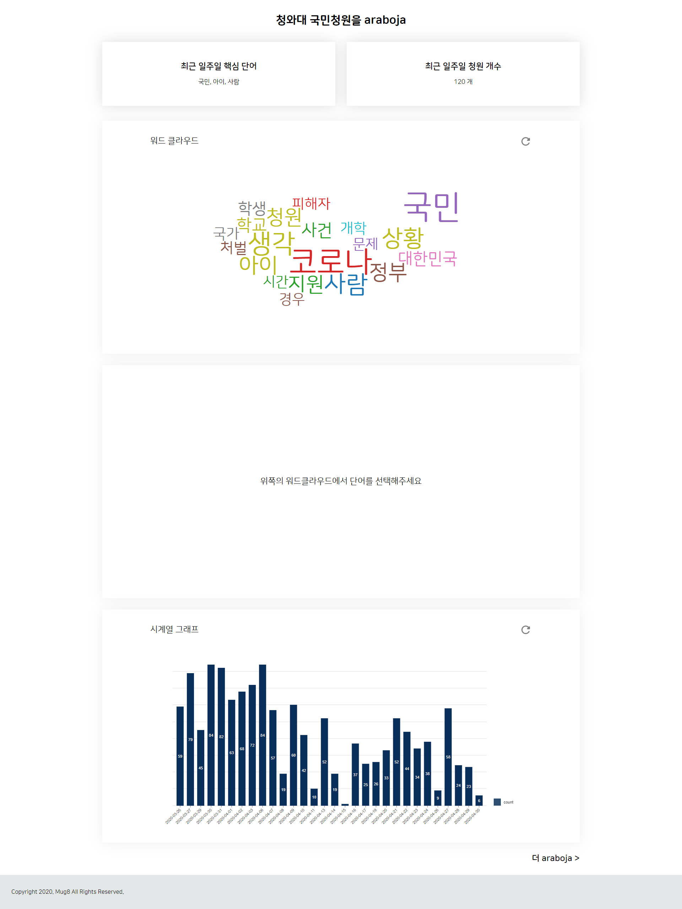
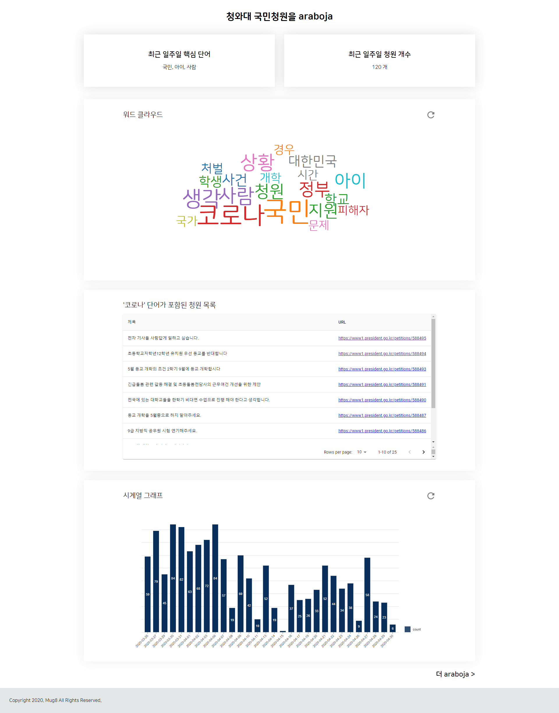

# BLUEBLUE

청와대 청원 게시판 분석 서비스 **(청청)**

http://www.studiomug8.com/blueblue/

## Description

- Crawler

  - Selenium, BeautifulSoup4를 이용한 청와대 국민청원 게시판 Scraping

- Client

  - React.js를 이용한 국민청원 분석 결과 Visualization

- API

  - Flask를 이용한 국민청원 분석 결과 RestAPI

- 화면 예시 (기본)
  
- 화면 예시 (단어 선택)
  

## Environment

- Ubuntu up to 16.04
- Chrome browser

## Prerequisites

- React.js
- Node.js
- Flask
- Beautifulsoup
- Selenium

## Installation

- Crawler

1. Install Python (up to 3.5)
2. Type below on terminal

```
~ cd crawler
~ python3 -m virtualenv venv
~ source venv/bin/activate
~ (venv) pip install requirements.txt (in virtual environment)
```

- API

1. Install Python (up to 3.5)
2. Type below on terminal

```
~ cd crawler
~ python3 -m virtualenv venv
~ source venv/bin/activate
~ (venv) pip install requirements.txt (in virtual environment)
```

- Client

1. Install Node.js from https://nodejs.org/
2. (optional) Install Yarn from https://classic.yarnpkg.com/en/docs/install#mac-stable
3. Type below on terminal

```
~ cd client
~ npm install
```

## Getting Started

- Crawler

```
~ cd crawler
~ source venv/bin/activate
~ python main.py
```

- API

```
~ cd api
~ source venv/bin/activate
~ python main.py
```

- Client

```
~ cd client
~ npm run build
~ serve -s build -l [port number]
```

## File Manifest

- api
  - config - api 설정 파일들
    - config.json - DB 정보, 인증 정보
    - stopword.json - 불용어 목록
  - libs
    - mysql_controller.py - mysql 컨트롤러
  - src
    - petition.py - 청원 정보
    - word.py - 키워드 정보
  - main.py
  - requirements.txt
- client
  - node_modules - npm 모듈들
  - public - React entry 페이지
  - src
    - components - 컴포넌트들
      - Dashboard.js - 상단 요약 영역
      - Footer.js - 하단 푸터 영역
      - PetitionList.js - 키워드별 청원 목록 영역
      - TimeGraph.js - 청원 개수 시계열 그래프 영역
      - Title.js - 페이지 제목 영역
      - Wordcloud.js - 워드클라우드 영역
    - context - 워드클라우드 키워드 컨텍스트
      - Keyword.context.js
      - KeywordProvider.js
    - css
      - Common.css
      - Dashboard.css
      - Footer.css
      - PetitionList.css
      - TimeGraph.css
      - Title.css
      - Wordcloud.css
    - fonts - 폰트들
    - icons - 아이콘들
    - services - 비즈니스 로직
      - api.js - RestAPI 커뮤니케이터
    - App.css
    - App.js
    - App.test.js
    - index.css
    - index.js
    - logo.svg
    - serviceWorker.js
    - setupTests.js
  - .gitignore
  - package-lock.json
  - package.json
  - README.md
  - yarn.lock
- crawler
  - config
    - config.json - DB 정보, 인증 정보
  - libs
    - mysql_controller.py - mysql 컨트롤러
    - tagger.py - 형태소 분석기
  - models
    - petition.py - 청원 정보 모델
  - src
    - crawler.py
  - .gitignore
  - chromedriver
  - main.py
  - requirements.txt
- LISENSE
- README.md

## Usage

1. When start client you can see the host and port like http://localhost:3000
2. Type this url in web browser

## Troubleshooting

## Contact Information

- Hyounoh Shim (hyounohshim@gmail.com)

## License

GNU General Public License v3.0
